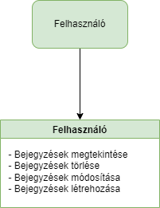
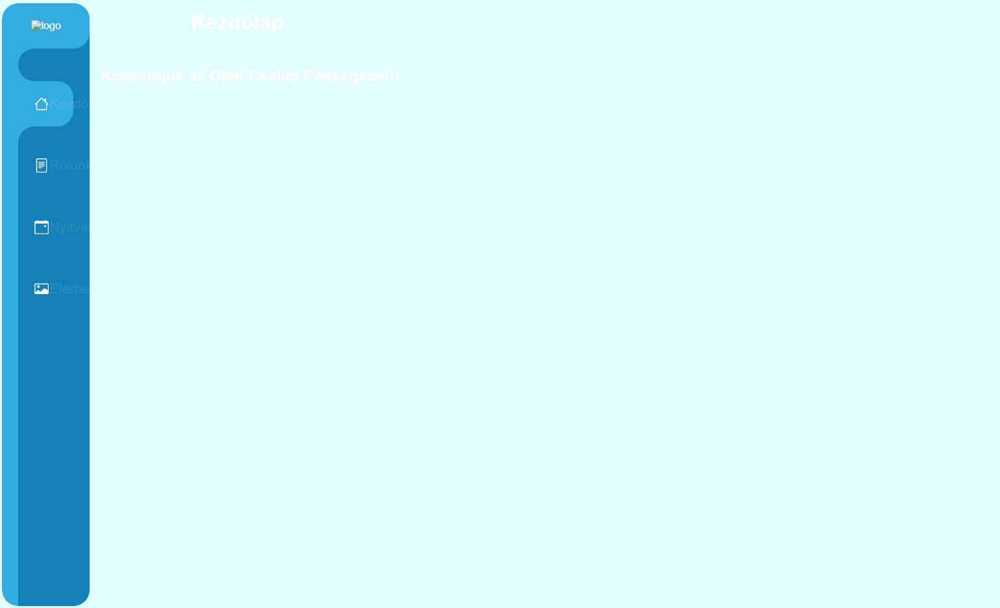

## 1. Áttekintés

A rendszer célja egy Webes felülettel rendelkező bejegyzés oldal. Ezen a felületen a felhasználók bejegyzéseket tudnak létrehozni és ezeket olvasni. 
Ezeket a bejegyzéseket az alkalmazás eltárolja, és képes lesz listázni azokat. 
Az oldal ingyenes lesz illetve csak a felhasználók által létrehozott bejegyzések kerülnek tárolásra.

## 2. Jelenlegi helyzet

A mai világban nagyon fontos egy olyan platform amelyen a felhasználók szabadon, cenzúra nélkül oszthatják meg gondolataikat, tapasztalataikat egy adott szolgáltatásról. A mi alkalmazásunk pontosan ennek ad megfelelő teret.

## 3. Követelménylista

Bejegyzések rész:
- A felhasználók megtekinthetik a létrehozott bejegyzéseket
- A felhasználók törölhetik a bejegyzéseket
- A felhasználók módosíthatják a létrehozott bejegyzéseket
- A felhasználók létrehozhatnak bejegyzéseket

## 4. Jelenlegi üzleti folyamatok modellje

## 5. Igényelt üzleti folyamatok modellje
    5.1 Felhasználók jogai
        5.1.1 A felhasználók létrehozhatnak bejegyzéseket
        5.1.2 A felhasználók megtekinthetik a bejegyzéseket
        5.1.3 A felhasználók módosíthatják a bejegyzéseket
        5.1.4 A felhasználók törölhetik a bejegyzéseket
    
## 6. Használati esetek

- **Az oldalra látogatva**
    - **Bejegyzések megtekintése**
    - **Bejegyzések létrehozása**
    - **Bejegyzések módosítása**
    - **Bejegyzések törlése**
## 7. Képernyőterv

## 8. Forgatókönyv

A program nem kíván különösebb telepítési és használati útmutatót. Elég, ha egy grafikus felülettel rendelkező webböngésző fel van telepítve ( alapértelmezett: windows - internet explorer / edge, linux: mozilla, mac - safari ). A felhasználó beüti az oldal címét: xyz.com a böngésző címsorába és rögtön át lesz irányítva az oldalra. Az oldal tartalmát a webszerver szolgáltatja a mögötte lévő adatbázis segítségével. Az oldalra átírányítva a felhasználó megkezdheti a bejegyzések létrehpzását. Ha a felhasználónak bármi nemű problémája akad az oldal működésével kapcsolatban, akkor a megadott elérhetőségek alapján tudja ezt jelezni az oldal karbantartói felé. Az oldal adminisztrátorai moderálják az oldalt a megfelelő eszközök segítségével. Az oldal karbantartásáért felelős csapat pedig az oldal rendeltetésének megfelelő működését ellenőrzi és javítja a felmerülő problémákat.

## 9. Fogalomszótár

- **UML** - Unified Modeling Language
- **Reszponzív felület** - Mobilon, Tableten, PC-n igazodik a
képernyőhöz a felület mérete, azaz több eszközön is probléma nélkül
üzemelhet
- **Corrective Maintenance:** A felhasználók által felfedezett és "user reportban"
elküldött hibák kijavítása.
- **Adaptive Maintenance:** A program naprakészen tartása és finomhangolása.
- **Perfective Maintenance:** A szoftver hosszútávú használata érdekében végzett
módosítások, új funkciók, a szoftver teljesítményének és működési
megbízhatóságának javítása.
- **Preventive Maintenance:** Olyan problémák elhárítása, amelyek még nem
tűnnek fontosnak, de később komoly problémákat okozhatnak.    