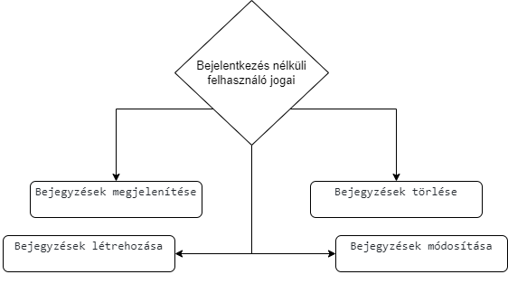

## 1. Áttekintés

A rendszer célja egy Webes felülettel rendelkező bejegyzés oldal. Ezen a felületen a felhasználók bejegyzéseket tudnak létrehozni és ezeket olvasni. 
Ezeket a bejegyzéseket az alkalmazás eltárolja, és képes lesz listázni azokat. 
Az oldal ingyenes lesz illetve csak a felhasználók által létrehozott bejegyzések kerülnek tárolásra.

## 2. Jelenlegi helyzet

A mai világban nagyon fontos egy olyan platform amelyen a felhasználók szabadon, cenzúra nélkül oszthatják meg gondolataikat, tapasztalataikat egy adott szolgáltatásról. A mi alkalmazásunk pontosan ennek ad megfelelő teret.

## 3. Vágyálom rendszer 

A weboldal célja, hogy a szolgáltatók visszajelzések alapján tudják javítani szolgáltatásaikat, termékeiket.
A weblap maga egy letisztult oldal a lehető legjobban átlátható, könnyen kezelhető, mindenki számára egyértelmű működéssel bírjon.

## 4. Funkcionális követelmények

  - **Felhasználók adatainak tárolása**
  - **Felhasználók tudják törölni a létrehozott bejegyzéseket**
  - **Felhasználók tudják módosítani a létrehozott bejegyzéseket**
  - **Felhasználók tudnak a létrehozni bejegyzéseket**
  - **Felhasználók meg tudják tekinteni a létrehozott bejegyzéseket**

## 5. Rendszerre vonatkozó törvények, szabványok, ajánlások

Opensource szoftver. Bárki által letölthető és felhasználható. Az értékesítése nem megengedett!  

## 6. Jelenlegi üzleti folyamatok modellje

        6.1 Bejegyzés létrehozása
                6.1.1 Cím megadása      
                6.1.2 Bejegyzés leírása

## 7. Igényelt üzleti folyamatok modellje

        7.1 Bejelentkezés nélküli felhasználók jogai:
                 7.1.1 Bejegyzések megjelenítése
                 7.1.2 Bejegyzések létrehozása        
                 7.1.3 Bejegyzések törlése
                 7.1.4 Bejegyzések módosítása

## 8. Követelménylista

Modul | ID | Név | Kifejtés
--- | --- | --- | ----------------------------------------------------------------------
Felület | K1 | Bejegyzés létrehozása  felület | Bejegyzés létrehozása
Felület | K2 | Bejegyzés szerkesztése | Bejegyzés törlése, frissítése
Felület | K3 | Bejegyzés megjelenítése | Bejegyzés megjelenítése
Back-end | K4 | Adatbázis kapcsolat létrehozása | Adatbázis kapcsolat létrehozása

## 9. Fogalomtár

- **UML** - Unified Modeling Language
- **Reszponzív felület** - Mobilon, Tableten, PC-n igazodik a
képernyőhöz a felület mérete, azaz több eszközön is probléma nélkül
üzemelhet
- **Releváns** - fontos, lényeges, meghatározó, jelentős
- **Corrective Maintenance:** A felhasználók által felfedezett és "user reportban"
elküldött hibák kijavítása.
- **Adaptive Maintenance:** A program naprakészen tartása és finomhangolása.
- **Perfective Maintenance:** A szoftver hosszútávú használata érdekében végzett
módosítások, új funkciók, a szoftver teljesítményének és működési
megbízhatóságának javítása.
- **Preventive Maintenance:** Olyan problémák elhárítása, amelyek még nem
tűnnek fontosnak, de később komoly problémákat okozhatnak.
