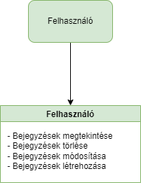

## 1. Rendszer célja

A rendszer célja egy webes felülettel rendelkező bejegyzésrendszer. Ezen a felületen a felhasználó bejegyzéseket tehet közzé és módosíthatja, törölheti azokat
Ezeket a bejegyzéseket a weboldal eltárolja egy adatbázisban és láthatóvá teszi az oldalt használó felhasználók számára.

## 2. Projektterv

### Projekttszerepkörök:
  * Termék tulajdonos: GTTG csapat
### Projekttmunkások és felelősségek:
  * Backend munkálatok: Kiss Barnabás, Szegedi Tamás
  * Frontend munkálatok: Koczka Gergő, Horváth Medárd

### Feladatuk: 
- adatbázis létrehozása az adatok tárolásához
- megfelelő funkciók elkészítése az oldal megfelelő működésének érdekében
- felhasználói felület kialakítása

### Ütemterv:
 - 09.28 Követelmény specifikáció 
 - 09.28 Funkcionális specifikáció
 - 09.28 Rendszerterv
 - 10.02 Adatbázis kialakítása
 - 10.04 Backend funkciók elkészítése
 - 10.04 Frontend design megtervezése
 - 10.05 Felhasználói felület kialakítása

 ## 3. Üzleti folyamatok modellje

 ## 4. Követelmények

**Funkcionális követelmények**
  - **Felhasználó bejegyzéseinek tárolása**
  - **Felhasználó tudják változtatni a bejegyzéseiket**
  - **Felhasználó tudják módosítani és törölni a létrehozott bejegyzéseiket**

  **Nem funkcionális követelmények**

  **Törvényi előírások, szabványok:**
  - **GDPR-nek való megfelelés**

  ## 5. Funkcionális terv

**Rendszerszereplők:**
  - **Felhasználó**

  **Rendszerhasználati esetek és lefutásaik:**
  - **Felhasználó**
    - **Megtekintheti a bejegyzéseket**
    - **Törölheti a korábban létrehozott bejegyzéseket**
    - **Módosíthatja a bejegyzéseket**
  

