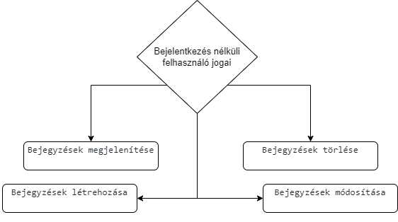
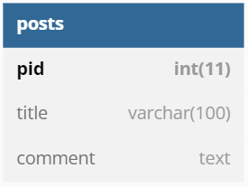

## 1. Rendszer célja

A rendszer célja egy webes felülettel rendelkező bejegyzésrendszer. Ezen a felületen a felhasználó bejegyzéseket tehet közzé és módosíthatja, törölheti azokat
Ezeket a bejegyzéseket a weboldal eltárolja egy adatbázisban és láthatóvá teszi az oldalt használó felhasználók számára.

## 2. Projektterv

### Projekttszerepkörök:
  * Termék tulajdonos: GTTG csapat
### Projekttmunkások és felelősségek:
  * Backend munkálatok: Kiss Barnabás, Szegedi Tamás
  * Frontend munkálatok: Koczka Gergő, Horváth Medárd

### Feladatuk: 
- adatbázis létrehozása az adatok tárolásához
- megfelelő funkciók elkészítése az oldal megfelelő működésének érdekében
- felhasználói felület kialakítása

### Ütemterv:
 - 09.28 Követelmény specifikáció 
 - 09.28 Funkcionális specifikáció
 - 09.28 Rendszerterv
 - 10.02 Adatbázis kialakítása
 - 10.04 Backend funkciók elkészítése
 - 10.04 Frontend design megtervezése
 - 10.05 Felhasználói felület kialakítása

 ## 3. Üzleti folyamatok modellje



 ## 4. Követelmények

**Funkcionális követelmények**
  - **Felhasználó bejegyzéseinek tárolása**
  - **Felhasználó tudják változtatni a bejegyzéseiket**
  - **Felhasználó tudják módosítani és törölni a létrehozott bejegyzéseiket**

  **Nem funkcionális követelmények**

  **Törvényi előírások, szabványok:**
  - **GDPR-nek való megfelelés**


  ## 5. Funkcionális terv

**Rendszerszereplők:**
  - **Felhasználó**

  **Rendszerhasználati esetek és lefutásaik:**
  - **Felhasználó**
    - **Megtekintheti a bejegyzéseket**
    - **Törölheti a korábban létrehozott bejegyzéseket**
    - **Módosíthatja a bejegyzéseket**
  
## 6. Fizikai környezet

- **Az alkalmazás csak web platformra készül, AWS EC2 instance-ra telepített Apache szerveren, MySQL adatbázissal lesz futtatva.**
  - **Nincsenek megvásárolt komponensek.**
  - **Fejlesztői eszközök:**
    - **Visual Studio Code**
    - **Notepad++**
    - **XAMPP**

## 7. Architekturális terv

A rendszer tökéletes működéséhez szükség van egy adatbázis szerverre, ebben az esetben MySql-t használunk. A bootstrap mint CSS keretrendszer felel a reszponzív webdesign-ért. A backend php alapú.

## 8. Adatbázis terv

### **Táblák**
- **posts:** Az oldalon létrehozott bejegyzések
  - **pid:** Azonosító szám, a bejegyzések egyedi azonosítója
  - **title:** A bejegyzések címe
  - **comment:** A bejegyzések tartalma


**DSL**


```

CREATE TABLE `posts` (
  `pid` int(11) NOT NULL COMMENT 'A bejegyzések azonosító száma',
  `title` varchar(100) NOT NULL COMMENT 'A bejegyzés címe',
  `comment` text NOT NULL COMMENT 'A bejegyzés szöveges tartalma'
) ENGINE=InnoDB DEFAULT CHARSET=utf8mb4;


ALTER TABLE `posts`
  ADD PRIMARY KEY (`pid`);


ALTER TABLE `posts`
  MODIFY `pid` int(11) NOT NULL AUTO_INCREMENT COMMENT 'A bejegyzések azonosító száma';
COMMIT;

```


**UML**




## 9. Implementációs terv

A webes felület HTML, CSS és PHP nyelven fog elkészülni. A különböző technológiákat amennyire csak lehet, külön fájlokba írva készítjük el, úgy csatoljuk egymáshoz ezzel is egy átláthatóbb, könnyebben változtatható és bővíthető weboldal lesz. Az adatokat egy MYSQL adatbázisban fogjuk tárolni.


## 10. Tesztterv

Az alább leírt tesztelések célja a rendszer és funkcióinak teljes körű vizsgálata, ellenőrzése.

Gombok, linkek tesztelése: tesztünk célja: a weboldalon megjelenő gombok és linkek megfelelő működésének ellenőrzése.
Adatrögzítések leelenőrzése, hogy sikeresen feltöltődtek-e az adatbázisba. 
Adatok betöltése az adatbázisból.

Műveletek tesztelése: Törlés, módosítás, hozzáadás.
A weboldal helyes működésének letesztelése különböző böngészőkben például Microsoft Edge, Google Chrome, Firefox…
A weboldal hibátlan megfelelő megjelenés tesztelése számítógépen illetve mobiltelefonon.

## 11. Telepítési terv

A szoftver webes felületéhez csak egy böngésző telepítése szükséges.

**Windows - Microsoft Edge**

**Linux - Mozilla Firefox**

**Mac - Safari**

A webszerverre közvetlenül az internetről kapcsolódnak rá a kliensek. A weboldal URL címét szükséges ismerni és ezt beírni a böngésző címsorába.

## 12. Karbantartási terv

A felhasználók az oldalon megadott elérhetőségen jelenthetik be az esetlegesen felmerülő problémákat, hibákat, melyeket fejlesztőink javítanak.


